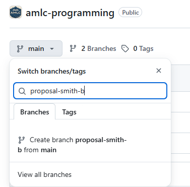

# amlc-programming
This repository tracks the programming efforts of the AMLC of the Rockies community, including proposed talks, workshops, meetups, and collaborative events.

# How to submit a proposal
Want to share your expertise to our community by submitting a talk, workshop, activity, or event? 
  
Follow the instructions below to make a submission:  
1. Create a new branch in the format `proposal-{surname}-{first initial}`. Bill Smith, a ficticious data science expert in our community, might name his branch `proposal-smith-b`.

2. Copy the template file `YYYY-MM-DD-title-of-your-proposal-template.md` in `proposals` to `proposals/submitted/`, renaming it reflect your proposal and fill out the required information. 
3. Save the file, commit it to your branch, create a Pull Request, and allow comments from the AMLC of the Rockies team.